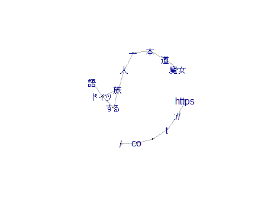
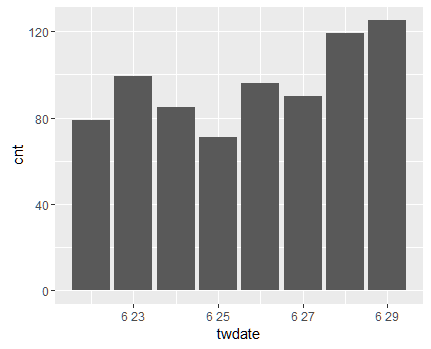
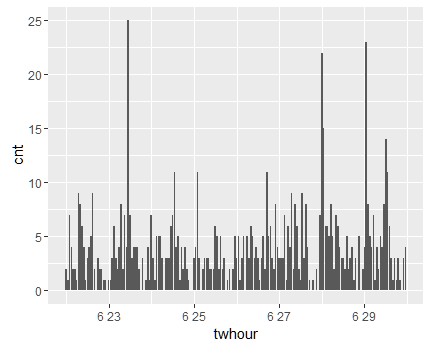
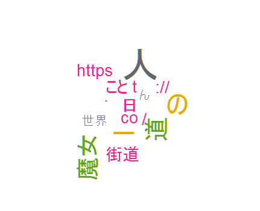
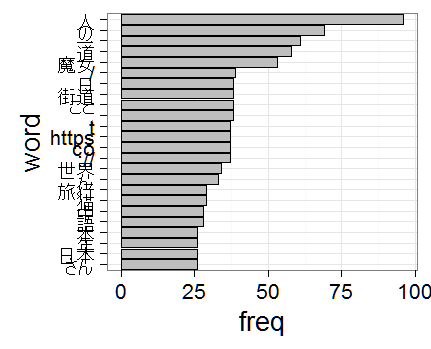

[](http://quantlet.de/index.php?p=info)

## [](http://quantlet.de/) **JapaneseTwitter** [](http://quantlet.de/d3/ia)

```yaml

Name of Quantlet : JapaneseTwitter

Published in : Introduction to Datamining in R

Description : Textminig and visualization for tweets in Japanese

Keywords : textminig, word cloud, network diagram

Author[New] : Yoshiro Yamamoto

Submitted : 2016-05-09, Yoshiro Yamamoto

Output : Some plots of number of tweet in a week, Word Cloud and Network diagram.

```












### R Code:
```r
# clear variables and close windows
# clear variables and close windows
rm(list = ls(all = TRUE))
graphics.off()

# install and load packages
libraries = c("twitteR", "ROAuth", "base64enc", "dplyr", "ggplot2", 
              "RMeCab", "wordcloud", "RColorBrewer", "igraph")
lapply(libraries, function(x) if (!(x %in% installed.packages())) {
  install.packages(x)
})
lapply(libraries, library, quietly = TRUE, character.only = TRUE)

# pre install RMeCab for Win
# install.packages("RMeCab", repos = "http://rmecab.jp/R")

# Twitter REST API
# GET search/tweets
# https://syncer.jp/twitter-api-matome/get/search/tweets
#
# Please change following keys into your own twitter Apps key
APIKey       = "6uSqLddicwPWF1C5qiLYgFxii"
APISecret    = "o8mKGWMOXJpGqwR2F5rH12iWXf1g6WsZlP7lROB8fSD5t8IIeD"
accessToken  = "74756179-Qbtef8SRTpEKhoYif7tygbTOeeSp1ApaOibPPsvqm"
accessSecret = "prbXalyRt82kYIzYaxZQboyNSCXTvv2iL2x6tQQDSr0wr"

setup_twitter_oauth(APIKey, APISecret, accessToken, accessSecret)
# select 1:
# change the key word(s) you want to search
searchword  = "????????? ???"
searchquery = iconv(paste0(searchword," AND -filter:links AND -RT"), to="UTF-8")
tw.df       = twListToDF(searchTwitter(searchquery, 
                                       since=as.character(Sys.Date()-8),
                                       until=as.character(Sys.Date()), n=10000))
names(tw.df)

# totalize of tweets
# total number of tweets for each day
tw.daily = tw.df %>%
  mutate(twdate=as.Date(created)) %>%
  group_by(twdate) %>% summarize(cnt = n())
tw.daily
ggplot(tw.daily, aes(twdate,cnt))+ geom_bar(stat="identity")
# PDF output
#cairo_pdf("tw-daily.pdf", width=8, height=8, family="MixMix 1P")
#ggplot(tw.daily, aes(twdate,cnt))+ geom_bar(stat="identity")+  #theme_bw(base_size=18)
#dev.off()

# total number of tweets for each day and hour
tw.hourly = tw.df %>%
  mutate(twhour=as.POSIXct(format(created, "%Y-%m-%d %H:00:00"))) %>%
  group_by(twhour) %>% summarize(cnt = n())
tw.hourly
ggplot(tw.hourly, aes(twhour, cnt))+ geom_bar(stat="identity")
# PDF output
#cairo_pdf("tw-hourly.pdf", width=8, height=8, family="MixMix 1P")
#ggplot(tw.hourly, aes(twhour, cnt))+ geom_bar(stat="identity", #fill=I("#666666")) +
#  theme_bw(base_size=18)
#dev.off()

# Preprocessing  ("RMeCab" package)
tw.txt = unique(tw.df$text)
tw.txt = gsub("[[:print:]]", "", tw.txt, perl=TRUE)
tw.txt = iconv(tw.txt, from="UTF-8", to="CP932", "")   # for Windos (SHIFT-JIS)
tw.txt = tw.txt[-grep("^RT", tw.txt)]

tw.dmat = docMatrixDF(tw.txt, pos = c("??????"))
dim(tw.dmat)

tw.wcnt = as.data.frame(apply(tw.dmat, 1, sum))
tw.wcnt = tw.wcnt[
  !(row.names(tw.wcnt) %in% unlist(strsplit(searchword, " "))),
  1, drop=FALSE]

tw.wcnt2 = data.frame(word=as.character(row.names(tw.wcnt)),
                      freq=tw.wcnt[,1])
tw.wcnt2 = subset(tw.wcnt2, rank(-freq)<25)
ggplot(tw.wcnt2, aes(x=reorder(word,freq), y=freq)) + 
  geom_bar(stat="identity", fill="grey",  color="black") +
  theme_bw(base_size=20) + coord_flip() + xlab("word")
# PDF output
#cairo_pdf("tw-wordcount.pdf", family="MigMix 1P", width=12, height=8)
#ggplot(tw.wcnt2, aes(x=reorder(word,freq), y=freq)) + 
#  geom_bar(stat="identity", fill="grey",  color="black") +
#  theme_bw(base_size=20) + coord_flip() + xlab("word")
#dev.off()

# word cloud ("wordcloud" package)
tw.wcnt = subset(tw.wcnt, tw.wcnt[, 1] >= 30)
pal     = brewer.pal(8,"Dark2")
wordcloud(row.names(tw.wcnt), tw.wcnt[, 1], scale = c(4, .2),
          random.order = T, rot.per = .15, colors = pal)
# PDF output
#cairo_pdf("tw-wordcloud.pdf", family="Meiryo", width=8, height=8)
#wordcloud(row.names(tw.wcnt), tw.wcnt[, 1], scale = c(4, .2),
#          random.order = T, rot.per = .15, colors = pal)
#dev.off()

# Network analysis ("igraph" package)
tw.file = tempfile()
write(gsub("\n", "", tw.txt), file=tw.file)
tw.bigram = NgramDF(tw.file, type = 1, N = 2,
                    c("??????", "?????????", "??????"))
sortlist  = order(tw.bigram[,3],decreasing = TRUE)
tw.bigram = tw.bigram[sortlist,]
tw.bigram = subset(tw.bigram, Freq>20)
head(tw.bigram)
tw.graph  = graph.data.frame(tw.bigram)

# selecting comunity
eb = edge.betweenness.community(tw.graph)

# Output network diagram
plot(tw.graph, vertex.label=V(tw.graph)$name,
     vertex.label.family="Meiryo",
     vertex.size=3*log(degree(tw.graph)),
     vertex.color=cut_at(eb, 10), edge.arrow.size=0.1,
     vertex.label.cex=1, edge.arrow.width=1)
# PDF output
#cairo_pdf("tw-network.pdf", family="Meiryo", width=8, height=8)
#plot(tw.graph, vertex.label=V(tw.graph)$name,
#     vertex.label.family="Meiryo",
#     vertex.size=3*log(degree(tw.graph)),
#     vertex.color=cut_at(eb, 10), edge.arrow.size=0.1,
#     vertex.label.cex=1, edge.arrow.width=1)
#dev.off()


```
